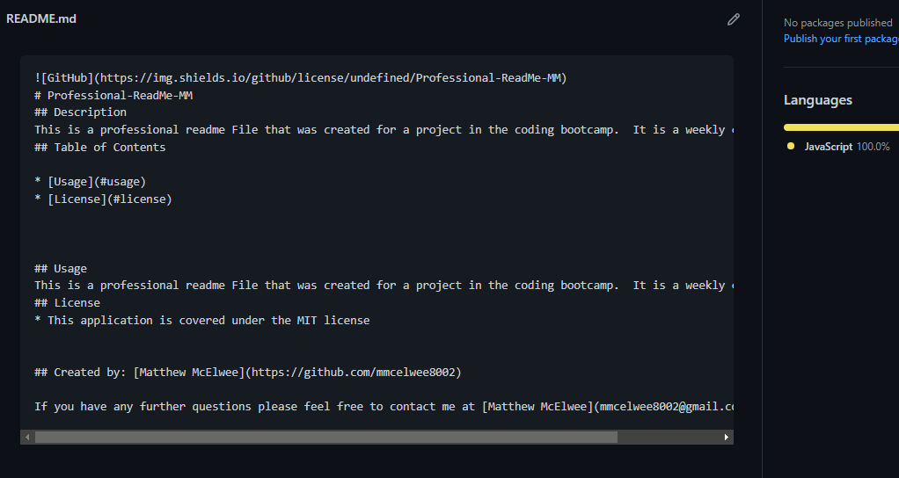

    ## Description
    This is a professional readme File that was created for a project in the coding bootcamp.  It is a weekly challenge.  #9.  

## Table of Contents
* [Installation instructions ](#Installation-instructions)
* [Usage instructions ](#Usage-instructions)
* [Contributing to this project ](#Contributing-to-this-project)
* [Credits](#Credits)
* [License](#License)
* [Testing Instructions](#Testing-Instructions)
* [Questions](#Questions)

    ## GitHub
    https://img.shields.io/github/license/undefined/Professional-README-Generator-MM

    # Professional-README-Generator-MM
    ## Description
    This is a professional readme File that was created for a project in the coding bootcamp.  It is a weekly challenge.  #9.  
    ## Table of Contents
    
    * [Usage](#usage)
    * [License](#license)
 

    

    ## Usage
    This is a professional readme File that was created for a project in the coding bootcamp.  It is a weekly challenge.  #9.  

    ## License
    * This application is covered under the MIT license
    
    ###Screenshot 

    
    
    ## Created by: [Matthew McElwee](https://github.com/mmcelwee8002)
    
    If you have any further questions please feel free to contact me at [Matthew McElwee](mmcelwee8002@gmail.com)
  